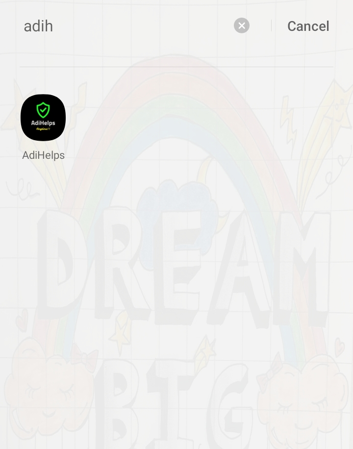
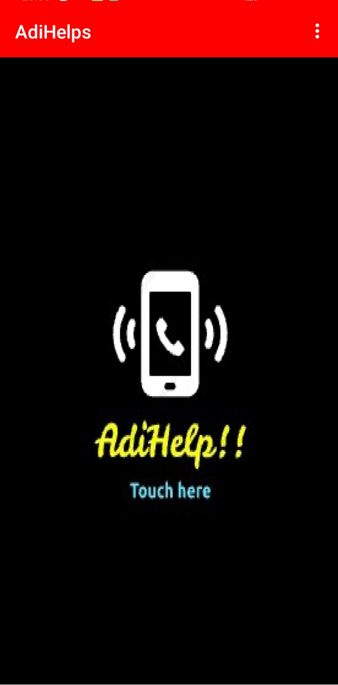
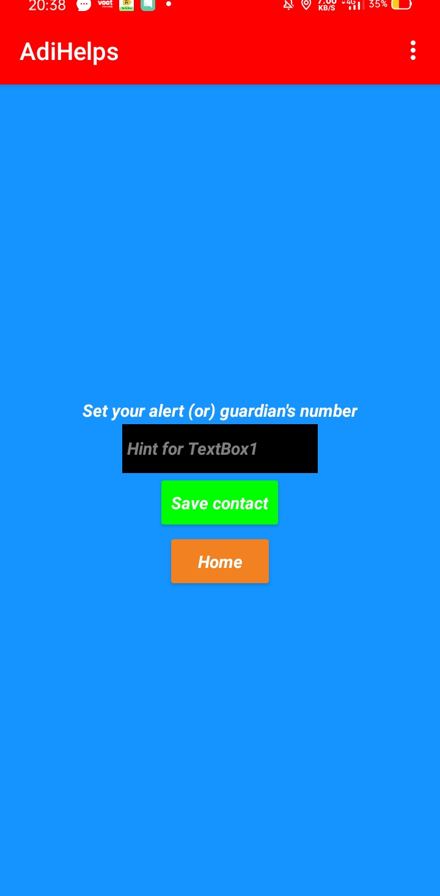
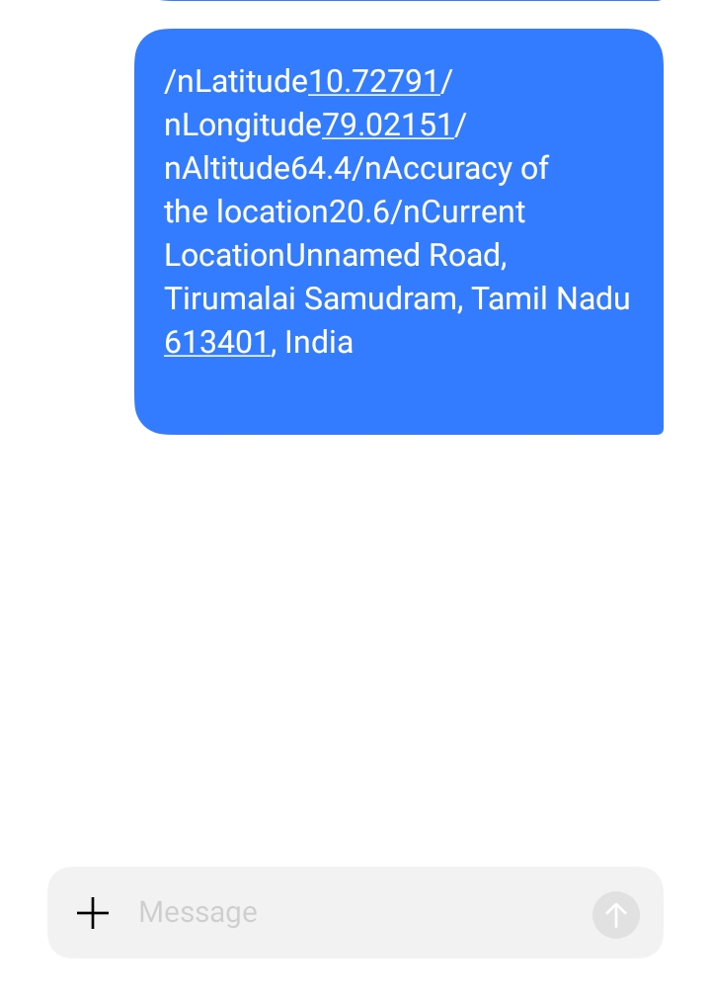

# AdiHelps
# AdiHelps - Safety App
I've created a safety app and named it as AdiHelps. I want to make this world a better place for living. I really want to do something to empower this society so I've taken a small step. Using this app we can reduce rapes, murder, eve teasing and other crimes.

# How my app works?
When you open my app, there will be a single screen. When you hold that screen, it will show you an another screen where you have to set your guardians number. Your guardians number will be saved in database. After setting guardians number, whenever you open either touch the screen or say(help, help me, Mujhe bachao), it recognizes your voice and it will directly message your guardian the following details.

1. Latitude
2. Longitude
3. Current address (accurate landmark)
4. Accuracy

Accuracy is nothing but the accurate location in metres. For example if it shows accuracy as 8, then it means that your child or victim is somewhere in that particular latitude in 8 metre radius. This is so accurate that you can save your child/victim as well as you can catch the criminal. This is my app's speciality.

# Screenshots

# Click on the AdiHelps.apk file and download it!
